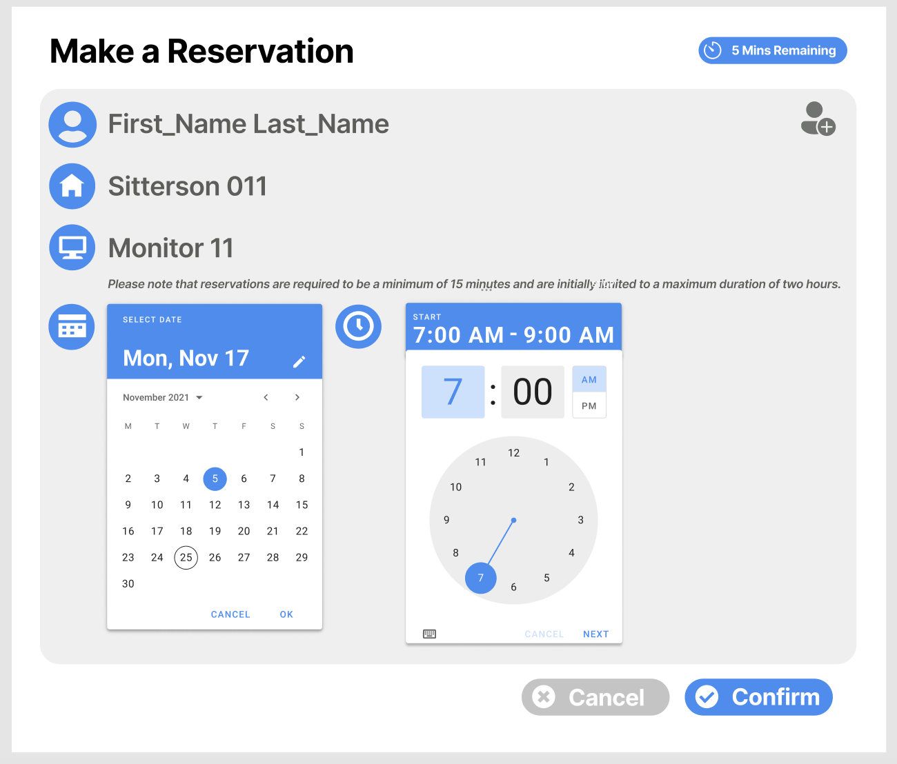
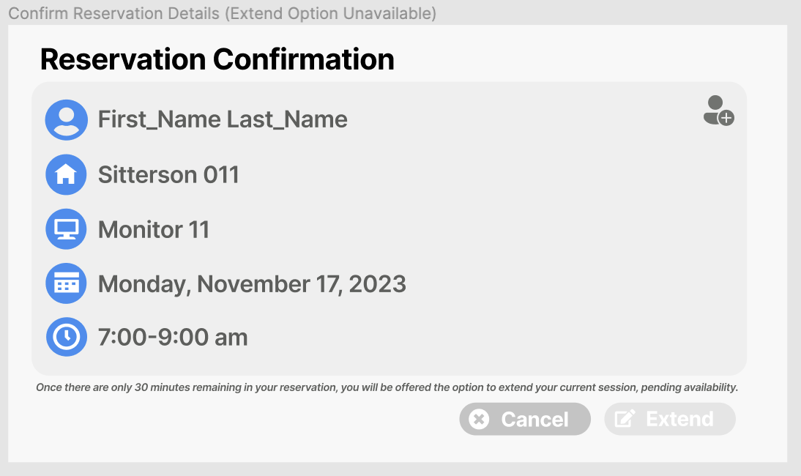
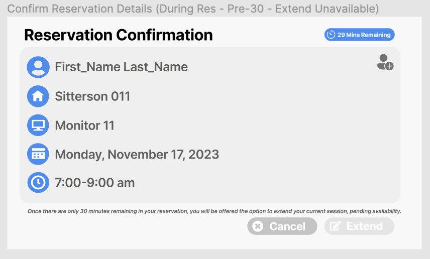
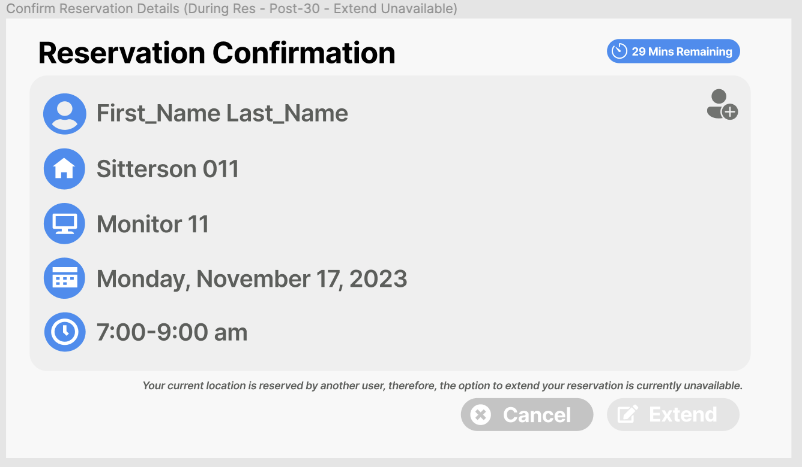
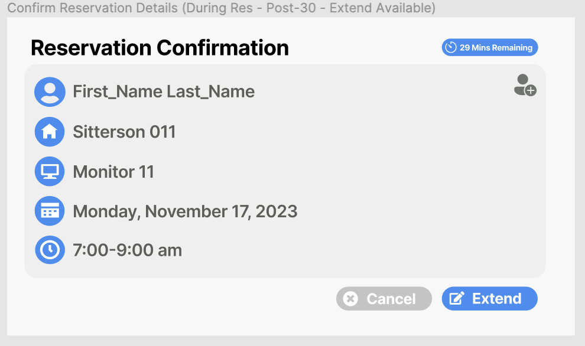
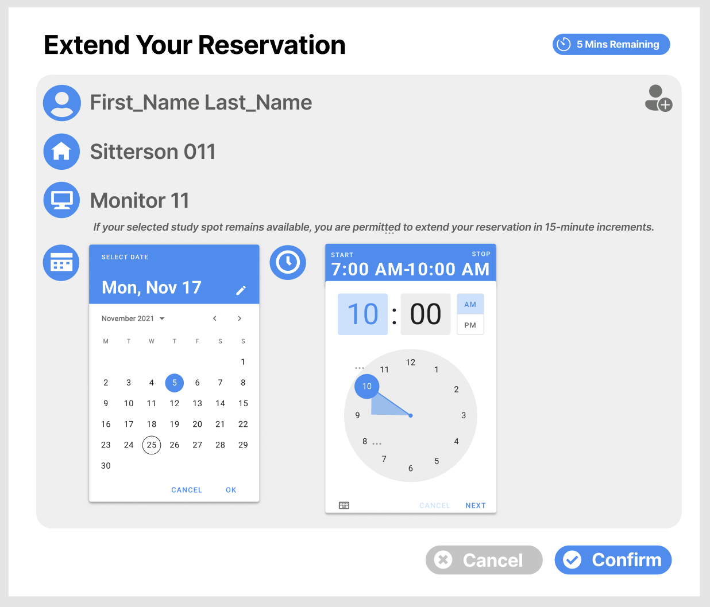

# Feature: Extending a Drop-in Reservation

> Authors:  Isha Atre (https://github.com/Ishaatre)  Chloe Carroll (https://github.com/chloeecarroll)  Lauren Jones (https://github.com/laurennnjones)  Soumya Mahavadi (https://github.com/ssmahavadi)  _Last Updated: 12/06/2023_

## Overview

This feature allows students who have 30 minutes or less left in their current drop-in reservation to be able to extend it for up to an additional hour, only if no other student has reserved their current seat immediately after.

Extending a reservation allows students currently working in the CSXL to continue working, while preserving a first-come first-serve reservation system. Currently, there's no way to schedule a reservation in advance and students can't reserve a seat for back to back reservations. If a student wanted to keep working, they would have to create a new reservation as soon as their current reservation ends and hope that another student didn't reserve it right before them. The ability to extend gives slight preference to students currently working in the CSXL because they're essentially able to make a new reservation 30 minutes in advance, whereas other students can only make reservations for seats open at the current time. However, by limiting it to a 30 minute window, it prevents students from immediately reserving/extending a seat for a prolonged period of time, and for lack of better terms, hogging a seat. It encourages the circulation of students through the CSXL. In the future, it would be a better use of the CSXL if students could select a more specific reservation time, as opposed to just 2 hours. Additionally, if the ability to schedule reservations in advance were implemented, being able to create reservations for only the time you need would ensure that seats aren't being left open unnecessarily. In our feature, we hoped to improve the customizability of the reservations by allowing the user to extend by 15, 30, 45, or 60 minutes depending on what they believe is necessary.

## Key Personas

**Sally Student** wants to know if her drop-in reservation can be extended and have the ability to extend it by up to an hour if so.

**Amy Ambassador** and **Rhonda Root** want the ability to view Sally Student's extended drop-in reservation.

## User Stories

**Story A:**
As Sally Student, once I've created a reservation and been checked-in by an ambassador, I want to see the time remaining in my reservation.

**Story B:**
As Sally Student, once I'm within 30 minutes of the end of my reservation, I want the option to extend.
If the CSXL lab is going to be open and my current seat(s) is unreserved following my reservation, I want the ability to extend for up to the maximum time possible (increments of 15 minutes, absolute max of 1 hour).

**Story C:**
As Amy Ambassador or Rhonda Root, I want the ability to view extended reservations. Additionally, I want the abiltiy to check-in and check-out students, and cancel reservations.

## Wireframes

Based on our wireframe, the initial landing page in the CSXL Lab is titled "Make a Reservation." Here, we have integrated image icons alongside key information such as "First Name," "Last Name," "Sitterson 011," "Monitor #," the date, and start-stop clock icons. These enhancements not only add to the visual appeal of the website, but also provide the users with more intuitive information compared to the original CSXL Reservation page. We have separated the "Confirm" button and the "Time Remaining to Cancel" feature to make it more user friendly and conform to industry's standards.

Moving on to the second page, "Reservation Confirmation," users are presented with text labels along with image icons, including "First Name," "Last Name," "Sitterson 011," "Monitor #," "Day and Date," and "Start and End Time." On this page, users have the option to click the button “Extend” in order to extend their reservation. This extend button should be available to click and blue only when there is 30 minutes left in the current reservation. Otherwise, the extend button will be greyed out if the student cannot extend the reservation because someone has reserved a seat or if there are more than 30 minutes left in the current reservation. This design decision aligns with a logical user flow, because the option to edit should follow the reservation confirmation since it is the final page the user has open.

Once the “Extend” button is clicked, it will direct the user to the last page, "Extend a Reservation", which has the same design as the "Make a Reservation" page's appearance. Here, users can adjust their reservation times in 15-minute increments up to 1 hour of additional time. This specific time interval was chosen because 5 minutes felt too short, and 30 minutes felt excessive for users looking to extend their original reservations.

## Technical Implementation Opportunities and Planning

**What specific areas of the existing code base will you directly depend upon, extend, or integrate with?**

We will directly depend upon the reservation models defined in backend/models/coworking/reservation.py as well as the API routes to retrieve and update existing reservations. Ideally, we'd like to utilize the update_reservation method in backend/api/coworking/reservation.py, but because entending should route the user to a new page, we may have to create a new one with a route involving the extension page rather than @api.put("/reservation/{id}", tags=["Coworking"]).

In the frontend, we will be adding a new extension component which will have a route from the current reservation component. We will also need to extend the current widgets used for the reservation card. We plan to add an extend method within the ReservationService located at frontend/src/app/coworking/reservation/reservation.service.ts.

**What planned page components and widgets, per the assigned reading, do you anticipate needing in your feature’s frontend?**

First, we anticipate editing the coworking-reservation-card located at frontend/src/app/coworking/widgets/coworking-reservation-card by adding an "extend" button that would only show up if an extension was permitted, as well as a countdown timer to reveal how much time is left in Sally Student's current reservation on the reservation confirmation page. We also plan to add a new page component for an extension form/page that Sally Student can navigate to if an extension is permitted, so that they can decide how much time to extend their current reservation by. In addition, we plan on adding a time picker widget (<https://m3.material.io/components/time-pickers/overview>, <https://stackoverflow.com/questions/45791339/how-to-implement-a-datetime-picker-in-ionic-2-to-select-time-range>) to coworking-reservation-card to improve the current UI in terms of selecting start and end times when creating a new reservation.

**What additional models, or changes to existing models, do you foresee needing (if any)?**

We do not foresee the need to create or change any models for this feature. We plan to utilize the ReservationDetails class predefined in backend/models/coworking/reservation.py, which already contains three attributes concerning extensions that are needed for our feature. We can use the SeatAvailability class located in backend/models/coworking/availability.py to determine whether or not Sally Student's seat is reserved for the next time slot. For Story D, we plan to update the current functionality of creating reservations to allow students to be able to reserve a seat for up to 2 hours in increments of 15 minutes. However, this will not require a change to the existing backend reservation model since the ReservationPartial class has fields to store the start and end times of the reservation.

**Considering your most-frequently used and critical user stories, what API / Routes do you foresee modifying or needing to add?**

We foresee calling upon the PUT API route found in backend/api/coworking/reservation.py to update Sally Student's current reservation with a new end time when they request an extension. We will also need a new route in the frontend for the extension page component we will add.

**What concerns exist for security and privacy of data? Should the capabilities you are implementing be specific to only certain users or roles?**

When Sally Student makes a reservation, only Sally Student, Amy Ambassador, and Rhonda Root should be able to see or cancel the reservation. Other students should not be able to cancel, extend, or even view Sally Student's reservation. Only Amy Ambassador and Rhonda Root should be able to see which students have current and scheduled reservations. If Sally Student want to extend her reservation but is not permitted to, due to time constraints or other reservations, she should not be able to access the extension page by URL path /coworking/reservation/{id}/extension. That specific page should only be accessible to users who can extend their reservations.
